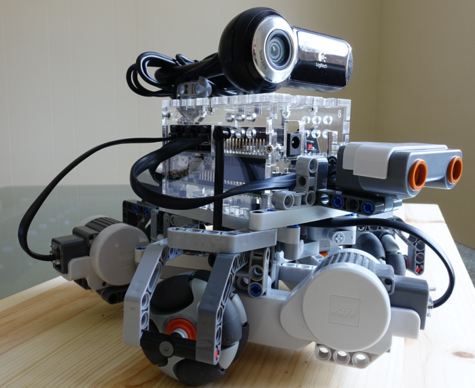

# TurBo
**Tur**tle-like Ro**Bo**t 

running [Windows 10 IoT Core](https://developer.microsoft.com/en-us/windows/iot) [Universal Windows Platform (UWP)](https://msdn.microsoft.com/en-us/windows/uwp/get-started/universal-application-platform-guide).

Some more details are available also on the [Hackster project page](https://www.hackster.io/perpetualkid/turbo-turtle-like-robot-ea7001)

#### Hardware 
- [Dexter BrickPi](http://www.dexterindustries.com/BrickPi/) board 
- [Raspberry Pi 2 Model B](https://www.raspberrypi.org/products/raspberry-pi-2-model-b/) 
- [LEGO MINDSTORMS](http://www.lego.com/mindstorms/)
- [HiTechnic Rotacaster Wheels](http://www.hitechnic.com/models)
- USB WebCam

